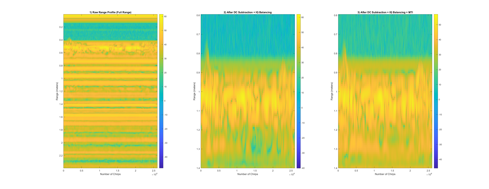
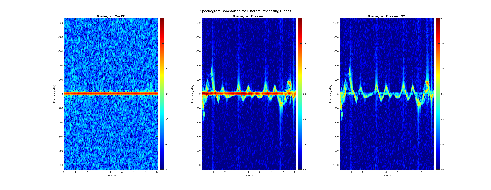

# Radar Signal Processing Toolbox

This repository contains MATLAB code and data for a complete radar signal processing pipeline including:
- Range Profile generation
- Range-Doppler Mapping
- Micro-Doppler (Spectrogram) Analysis

The processing chain is implemented for sample radar data, showcasing different levels of preprocessing (raw, DC/IQ balanced, MTI filtered), and visualized in a series of plots and animations.

---

## Repository Structure

```
├── data_processing.m            # Main driver script
├── class_01_Ali_1.mat           # Raw radar dataset
├── functions/                   # All modular processing functions
│   ├── dcSubtraction.m
│   ├── iqBalancing.m
│   ├── mtiFiltering.m
│   ├── generateRangeProfile.m
│   ├── generateRangeDopplerMap.m
│   ├── generateSpectrogramFromRP.m
│   ├── displayRDMVideo.m
│   ├── plotRangeProfileMap.m
│   └── plotSpectrogramSubplot.m
├── results/                     # Output folder (generated by the script)
│   ├── RangeProfiles.png
│   ├── RangeProfiles.fig
│   ├── RangeDoppler_2xSpeed.avi
│   ├── SpectrogramComparison.png
│   └── SpectrogramComparison.fig
```

---

## 🚀 Getting Started

1. Clone the repository:
```bash
git clone https://github.com/your-username/radar-signal-processing.git
cd radar-signal-processing
```

2. Open MATLAB and set the working directory to the repo folder.

3. Run the main script:
```matlab
>> data_processing
```

4. The script will:
   - Load the sample dataset
   - Generate range profiles, range-Doppler maps, and spectrograms
   - Save all results to the `results/` folder

---

## 📂 Output Visualizations

### 1. Range Profiles
Visualizes the range profile at 3 stages:
- Raw
- DC substraction + IQ balancing
- DC substraction + IQ balancing + MTI



---

### 2. Range-Doppler Maps
Compares temporal Doppler content:
- Raw
- DC substraction + IQ balancing
- DC substraction + IQ balancing + MTI


➡️ See the full video: `results/RangeDoppler_2xSpeed.avi`

---

### 3. Micro-Doppler Spectrograms
Time-frequency signature from the median range bin:

- Raw
- DC substraction + IQ balancing
- DC substraction + IQ balancing + MTI



---

## ⚙️ Customization

You can customize several aspects by editing `data_processing.m`:
- **Range Gates**: `RMin`, `RMax`
- **MTI Cutoff**: `cutoff`
- **FFT Sizes**: `NFFTVel`, `rd_window_size`, `shift`
- **Spectrogram STFT settings** inside `generateSpectrogramFromRP.m`

---

## 📦 Dependencies
- MATLAB (R2021 or newer recommended)
- Signal Processing Toolbox (for filtering functions)

---

---

## ✉️ Contact
**Author:** Sabyasachi Biswas; sabyasachi1406147gmail.com 
For questions or issues, please open an Issue or contact via GitHub.

---

Enjoy exploring radar signals! 📡

